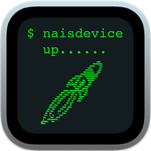

# naisdevice up

Should preferably be run on a clean system.

### Usage: 
* Download .app bundle
* Run `sudo xattr -d -r com.apple.qurantine /path/to/naisdevice\ up.app`
* Doubleclick should do the trick

TODO: Build, Sign & Notarize for release.

MAYBE: Add cloning capabilities.

MAYBE: (Maybe) Smooth the path so there are less failing checks in Kolide.